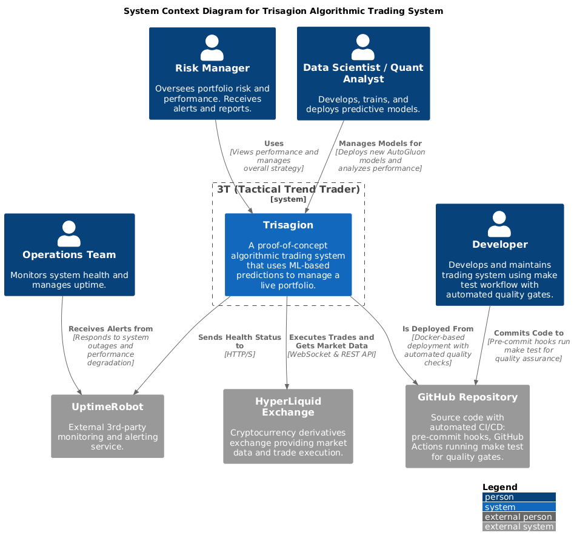
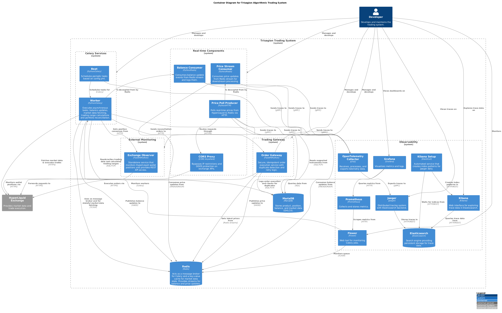
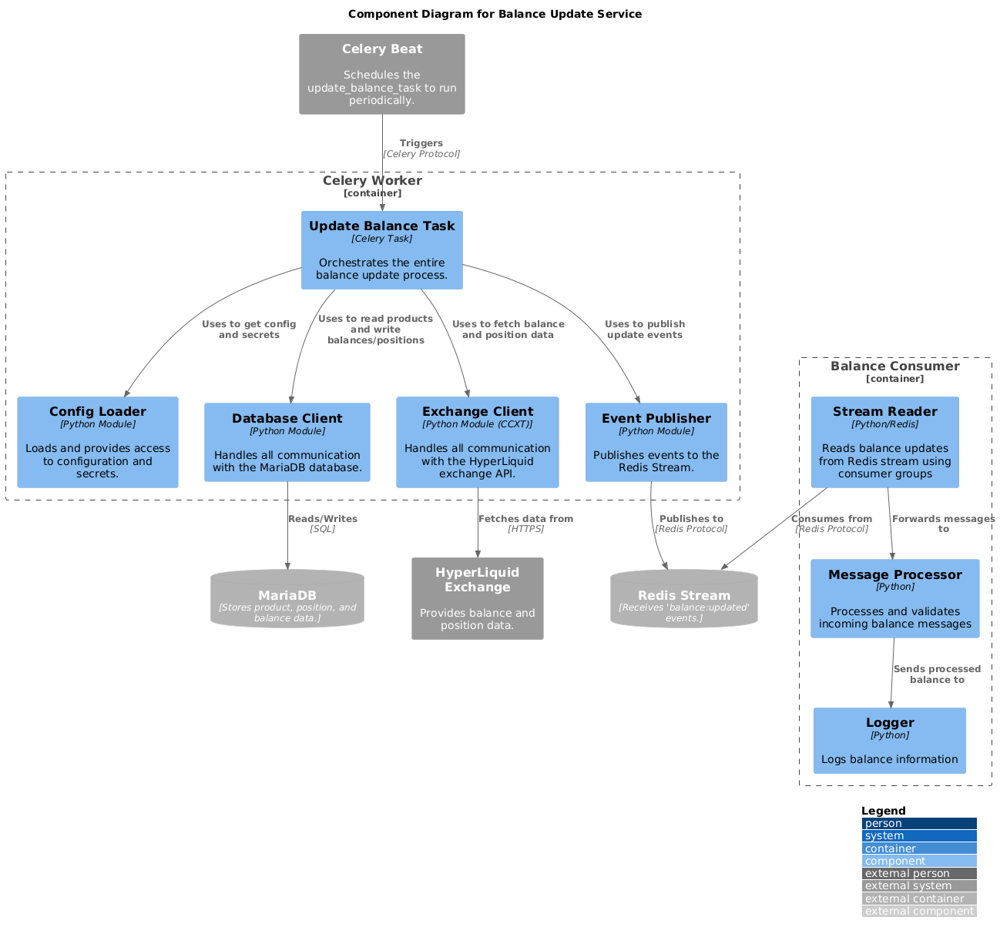

# Tactical Trend Trader (3T)

```
              P

           /  .  \
        S /  -|-  \ S 
         /` . | . `\
        /    `.`    \
              |   
         _ _ _ _ _ _

              F
```

## Introduction

Tactical Trend Trader (3T) is a sophisticated, service-oriented platform designed for automated trend trading. It leverages a robust architecture to analyze market data, execute trades, and provide real-time observability into its operations.

## Architecture

The 3T system is built on a microservices architecture, with each component containerized using Docker for portability and scalability. The primary components are:

- **Celery Services**: A directory containing the Celery worker and beat services for asynchronous task processing.
- **Python Components**: A directory containing various Python services that are not part of the Celery cluster.
- **Redis**: A high-performance in-memory data store used for message brokering, caching, and real-time event streams.
- **MariaDB**: A relational database used for persistent storage of trading data, positions, and configuration.

### Observability & Monitoring Stack
- **Elasticsearch**: Search and analytics engine providing persistent storage for trace data.
- **Jaeger**: Distributed tracing system with Elasticsearch backend for monitoring microservices interactions.
- **Kibana**: Web interface for exploring and visualizing trace data stored in Elasticsearch.
- **OpenTelemetry Collector**: Receives, processes, and exports telemetry data from services to Jaeger.
- **Prometheus**: Monitoring and alerting toolkit that collects metrics from various services.
- **Grafana**: Platform for visualizing metrics with pre-built dashboards for monitoring the 3T system.
- **Flower**: Web-based tool for monitoring and administering Celery jobs and workers.

The system architecture is documented using the C4 model, and the diagrams can be found in the `docs/arch` directory. The diagrams are written in PlantUML and can be generated using the PlantUML extension for VS Code or other PlantUML-compatible tools.

### Data Pipeline

The system features two main data pipelines:

1.  **Price Data**: The `price_stream_producer` service connects to the HyperLiquid exchange via WebSocket and streams real-time price data to a Redis stream. The `price_stream_consumer` service then consumes this data for further processing.
2.  **Balance Data**: The `celery_worker` periodically fetches balance and position data from the exchange and publishes it to a Redis stream. The `balance_consumer` service consumes this data to log and monitor the system's financial status.
3.  **Portfolio Reconciliation**: The `reconciliation_engine` within the `celery_worker` periodically compares the desired portfolio state (defined in the `runs` table) with the actual state (from the local database and external observer nodes). It generates and executes corrective orders via the `order_gateway` to ensure the portfolio remains aligned with the target strategy.

### Networking

#### Proxy Configuration

To enhance reliability and bypass potential IP-based restrictions from exchanges, the system supports routing traffic through a proxy. This is particularly useful for overcoming DDOS protection measures.

-   **Automatic Mode Selection**: The system automatically detects the proxy configuration in `config.yml`.
    -   **With Proxy**: It uses a polling-based price producer (`price_poll_producer.py`) that sends requests via the proxy.
    -   **Without Proxy**: It falls back to the default real-time WebSocket streaming (`price_stream_producer.py`).
-   **Configuration**: To enable the proxy, add the following to your `config.yml`:
    ```yaml
    exchanges:
      hyperliquid:
        proxy: "http://your-proxy-url:8080/"  # URL of the CORS proxy
        origin: "https://your-origin.com"      # Origin header for CORS
    ```
-   **CORS Proxy Service**: The `docker-compose.yml` file includes a `cors-proxy` service (`redocly/cors-anywhere`) to facilitate this. For local development, you can use the default, but for production, you should configure it with a proper whitelist.










## Getting Started

To get started with the 3T system, you will need to have Docker and Docker Compose installed on your system.

1. **Clone the repository:**

   ```bash
   git clone https://github.com/tttrisagion/3T.git
   cd 3T
   ```

2. **Create a `secrets.yml` file:**

   Copy the `secrets.yml.example` file to `secrets.yml` and populate it with your actual secrets and API keys.

   ```bash
   cp secrets.yml.example secrets.yml
   ```

3. **Start the services:**

Note: Your system must have docker and docker-compose available. The docker service must be running and you may need elevated sudo permissions. It is also reccomended to prepare your environment with `pip install -r requirements-dev.txt` before proceeding further.

   ```bash
   make install
   # or alternatively:
   docker-compose up -d --build
   ```

   This will start all services in detached mode and automatically configure Kibana with Jaeger index patterns.

4. **Initialize the database:**

   After starting the services for the first time, you need to manually initialize the database schema.

   ```bash
   docker-compose exec -T mariadb mysql -u root -psecret 3t < database/init.sql
   ```

5. **Access the dashboards:**

   - **Grafana**: http://localhost:3000/dashboards
   - **Jaeger**: http://localhost:16686 (distributed tracing UI)
   - **Kibana**: http://localhost:5601 (trace data exploration)
   - **Flower**: http://localhost:5555 (Celery monitoring)
   - **Prometheus**: http://localhost:9090 (metrics)
   - **Elasticsearch**: http://localhost:9200 (API access)

## Development

For development commands, testing procedures, and detailed technical guidance, see [CLAUDE.md](CLAUDE.md). Key commands:

- **Deploy code changes**: `docker-compose restart` (no rebuild needed)
- **Run tests**: `make test`
- **Stop and clean**: `make clean`

## Observability

The 3T system is designed for high observability, with a comprehensive suite of tools for monitoring, tracing, and debugging.

- **Metrics**: Prometheus scrapes metrics from Flower and other services, visualized in Grafana dashboards.
- **Distributed Tracing**: All services are instrumented with OpenTelemetry, sending traces through the OTEL Collector to Jaeger with persistent Elasticsearch storage.
- **Trace Exploration**: Kibana provides a web interface for exploring trace data with automatically configured index patterns.  
- **Real-time Monitoring**: Live trace data can be viewed in Kibana with auto-refresh capabilities to monitor system activity.
- **Automated Setup**: Kibana index patterns are automatically created during deployment for immediate use.

# Documentation

For technical documentation please see https://trisagion.gitbook.io/trisagion-docs/technology

## Roadmap

The current plans for this repository involve migrating the proof-of-concept functionality into a more refined architecture that provides:

- **Enhanced Trading Strategies**: Implementing more sophisticated trading strategies and models.
- **Advanced Analytics**: Integrating advanced analytics and machine learning to improve trading performance.
- **Real-time Portfolio Management**: Developing a real-time portfolio management system to track and manage assets.
- **Expanded Exchange Support**: Adding support for more cryptocurrency exchanges and trading pairs.

The future plans for the 3T project are updated here https://trisagion.gitbook.io/trisagion-docs/technology/research-and-roadmap

## Contributing

Contributions to the 3T project are welcome. Please refer to the [contributing](https://github.com/tttrisagion/3T/blob/main/CONTRIBUTING.md) guidelines for more information.

## Disclaimer

This project is provided "as is" and "with all faults." The authors and contributors disclaim all warranties, express or implied, including any warranties of merchantability, fitness for a particular purpose, and non-infringement.

In no event shall the authors or contributors be liable for any claim, damages, or other liability, whether in an action of contract, tort, or otherwise, arising from, out of, or in connection with the software or the use or other dealings in the software.

## License

The 3T project is licensed under the [MIT License](https://github.com/tttrisagion/3T/blob/main/LICENSE).
